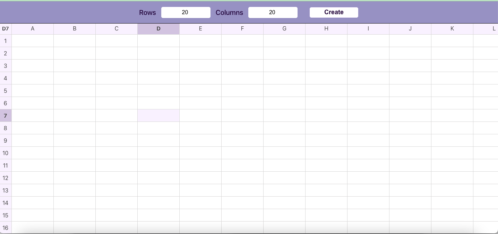

# 📊 Excel-Like Grid in React

An Excel-style interactive grid built with React — supports editable cells, keyboard navigation, dynamic headers, and a clean UI.

---

## 🚀 Live Demo

CodeSandbox - (https://codesandbox.io/p/github/uditnigam/Excel-React/main?import=true) 🌐

---

## 🧠 Features

- 🔤 A-Z column headers and 1-N row indexes
- ✍️ Inline editable input in every cell
- ⌨️ Full keyboard navigation
  - Arrow keys
  - Tab to move right (like Excel)
- 🖱️ Click to select cells
- 📍 Active cell tracking (shows "A1", "B2", etc.)
- 🧩 Modular component design

---

## 🛠 Tech Stack

| Tech         | Description                 |
|--------------|-----------------------------|
| React        | Frontend Framework          |
| JavaScript   | Language                    |
| CSS          | Styling                     |
| HTML         | Markup                      |

---

## 🧠 Future Enhancements

➕ Insert/Delete rows & columns

💾 Save grid to local storage

📤 Export data to CSV

🔍 Column filtering